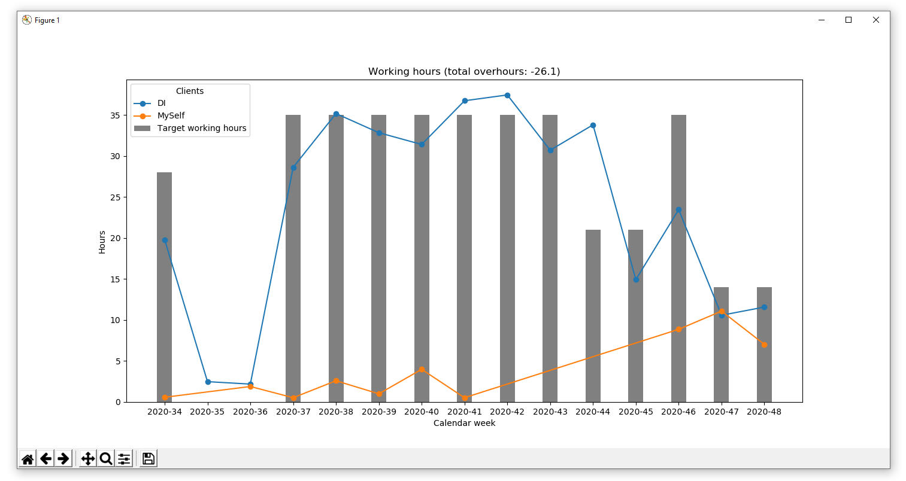

# Working hours analysis with Toggl and Python

> Collects Toggl time tracking events and uses them to analyse the time you are working for different projects and clients

Since I am using Toggl Track (https://toggl.com/track/) for tracking my working time for private and work related projects, the time records became much more accurate, what
helps me to evaluate my own work and productivity.

To perform analyses and create customized visualisations with Python and Matplotlib, the script collects the tracked working hours via Toggl API. To calculate the target working hours for each week and month, its necessary to know, which day is a working day. Therefor the information about my vacation days is stored in config.py and the puplic holidays get pulled from suitable web pages.

