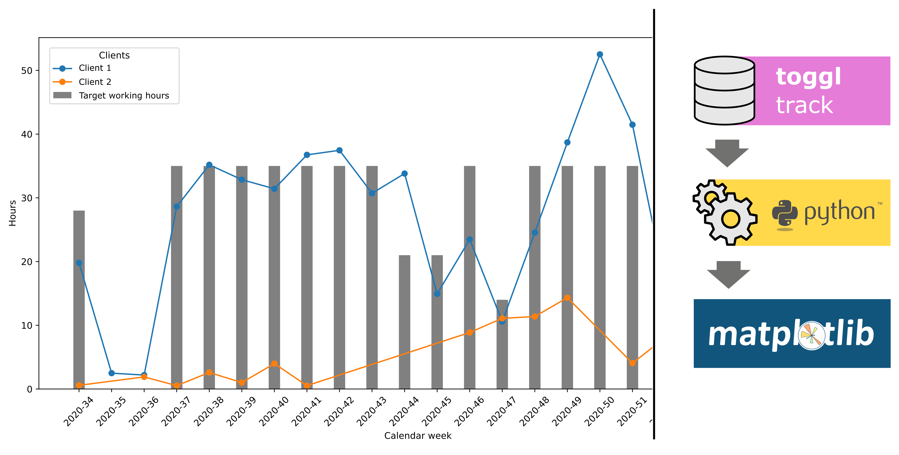

# Work time analysis with Toggl and Python

> Collects Toggl time tracking events and uses them to analyze the time you are working for different projects and clients

Toggl Track is a time tracker that allows you to track and manage your time in the easiest way possible. Installed on your computer, Toggl reminds you to record your time, which gives me a much more accurate and stress-free record of my working time.

While the recording of times with Toggl is unbeatable, the evaluation of working time does not meet all my needs (at least the free version). The visualization possibilities are limited and further calculations are only feasible in a cumbersome way. Thats the reasion why I started to use the data from Toggl to implement my own calculations and visualizations with Matplotlib and further on with some BI Tools like Grafana. The big advantage for me personally, is an automated calculation of overtime and the hours I have worked for individual projects.

To perform analysis and create visualizations for my personal needs, I began to retrieve the data from Toggl. For calculating overtime some more information is needed. I was looking for a data source which points out for each day if it’s a working day, weekend or public holiday. I decided to just use a web scraper to collect the public holidays for the specific region I am living in. The Personal information like days off and the target working hours per day are simply stored in a config.py file.

## Data sources:

* Toggl API: Tracked time data
* Web Scraper: Public holidays
* Config.py: Personal data e.g. vacation days

